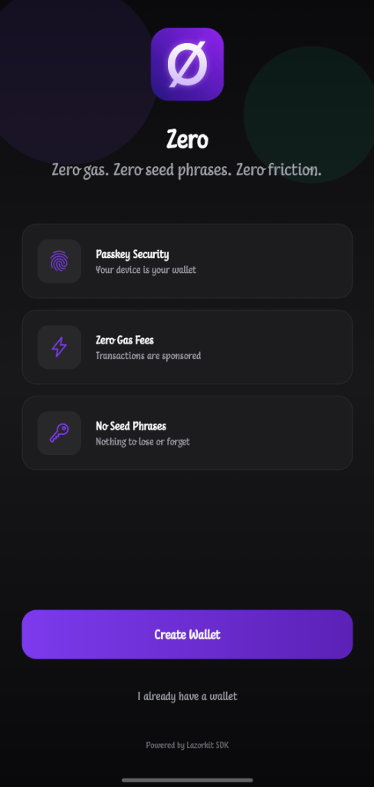
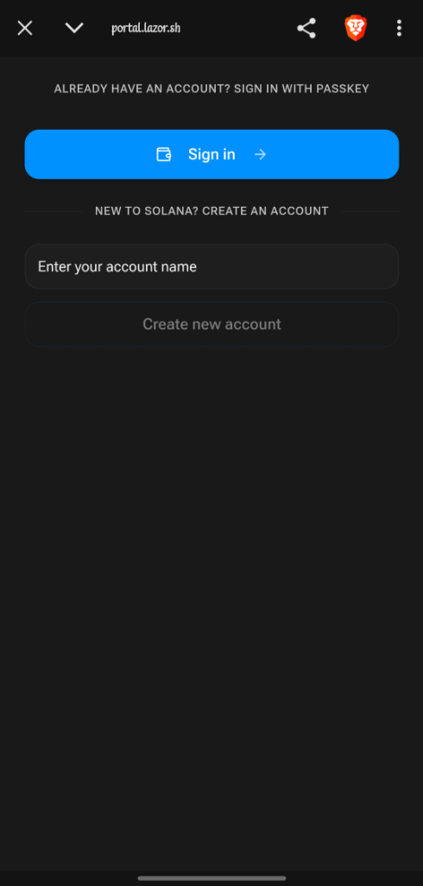
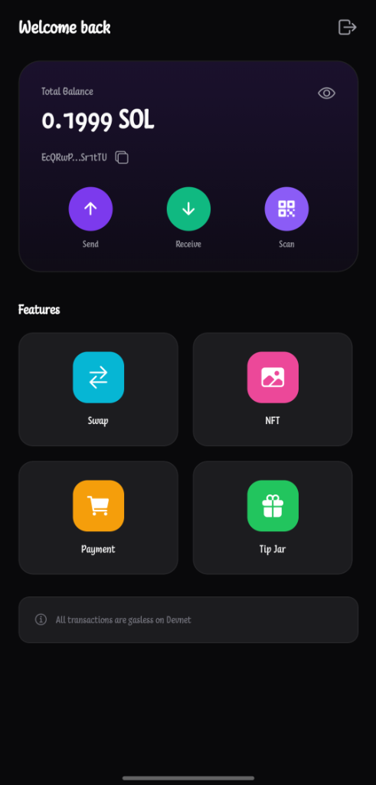
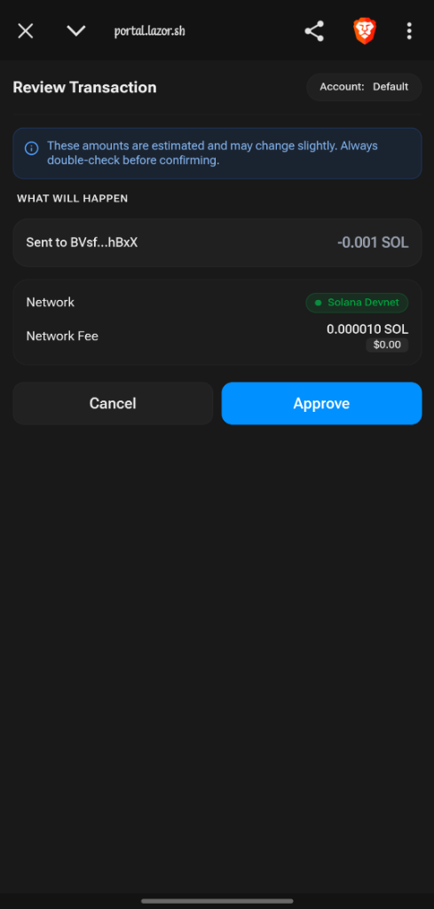
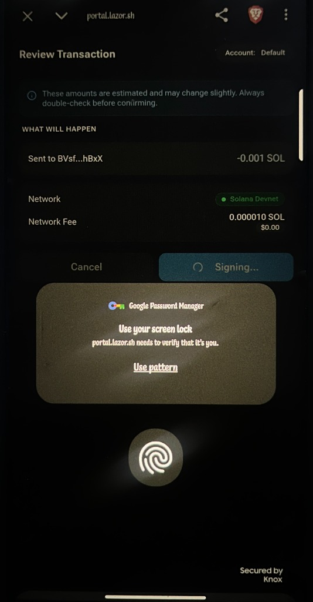
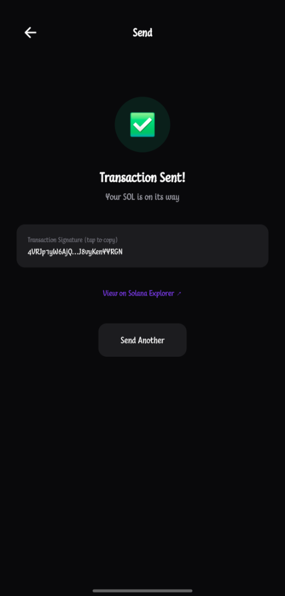

# Ø Zero

A premium React Native wallet showcasing [Lazorkit SDK](https://docs.lazorkit.com) for passkey-powered Solana wallets with gasless transactions.

**Zero gas. Zero seed phrases. Zero friction.**

## Features

| Feature | Description |
|---------|-----------|
| 🔐 Passkey Auth | Biometric login (Face ID, fingerprint) |
| ⚡ Zero Gas | Transactions sponsored via Kora paymaster |
| 💸 Send Tokens | Transfer SOL or SPL tokens |
| 📥 Receive | QR code display for receiving payments |
| 📷 QR Payments | Scan Solana Pay QR codes |
| 🔄 Token Swap | Swap via Jupiter |
| 🎨 NFT Minting | Mint with Metaplex Core |

## Screenshots

| Welcome | Sign In | Dashboard |
|---------|---------|-----------|
|  |  |  |

| Transaction Approval | Passkey Auth | Success |
|---------------------|--------------|---------|
|  |  |  |

## Quick Start

```bash
# Clone
git clone https://github.com/AngryPacifist/zero-app.git
cd zero-app

# Install
npm install

# Run
npx expo start --clear
```

Scan the QR code with **Expo Go** to run on your device.

## Download

| Platform | Link |
|----------|------|
| **Android** | [Download APK](https://expo.dev/artifacts/eas/s4KarHNPjixncbqsRHDC9J.apk) |
| **iOS** | Run via Expo Go (clone & `npx expo start`) |

## Project Structure

```
src/
├── App.tsx                 # Main navigation (React Navigation)
├── config/                 # Colors, endpoints, branding
├── components/             # Reusable UI components
│   └── ScreenWrapper.tsx   # Dark background wrapper
├── screens/                # UI screens
│   ├── WelcomeScreen.tsx   # Passkey creation
│   ├── DashboardScreen.tsx # Feature hub
│   ├── SendScreen.tsx      # Token transfers
│   ├── ReceiveScreen.tsx   # QR code display
│   ├── SwapScreen.tsx      # Jupiter swap
│   └── ...
└── utils/                  # Helpers
```

## Documentation

See [docs/](./docs) for detailed tutorials:

- [Getting Started](./docs/getting-started.md)
- [Passkey Wallet](./docs/passkey-wallet.md)
- [Gasless Transactions](./docs/gasless-transactions.md)
- [Protocol Integrations](./docs/protocol-integrations.md)

## Tech Stack

| Package | Purpose |
|---------|---------|
| `@lazorkit/wallet-mobile-adapter` | Passkey wallet SDK |
| `@solana/web3.js` | Solana core |
| `@react-navigation/native` | Screen navigation |
| `expo` | React Native framework |
| `expo-system-ui` | Native dark mode |
| `react-native-qrcode-svg` | QR code generation |

## Configuration

Edit `src/config/index.ts`:

```typescript
export const CONFIG = {
    RPC_URL: 'https://api.devnet.solana.com',
    PAYMASTER_URL: 'https://kora.devnet.lazorkit.com',
};
```

## Resources

- [Lazorkit Docs](https://docs.lazorkit.com)
- [GitHub](https://github.com/lazor-kit/lazor-kit)
- [Telegram](https://t.me/lazorkit)

## License

[MIT](./LICENSE)
